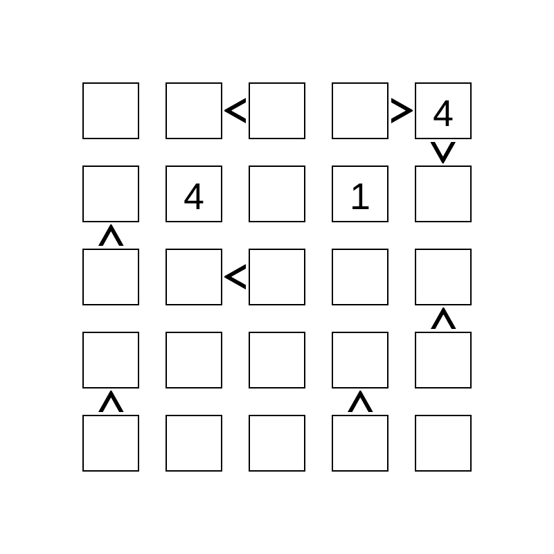
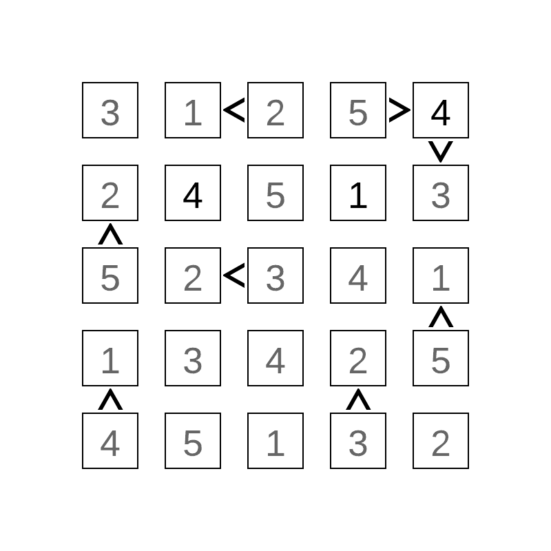
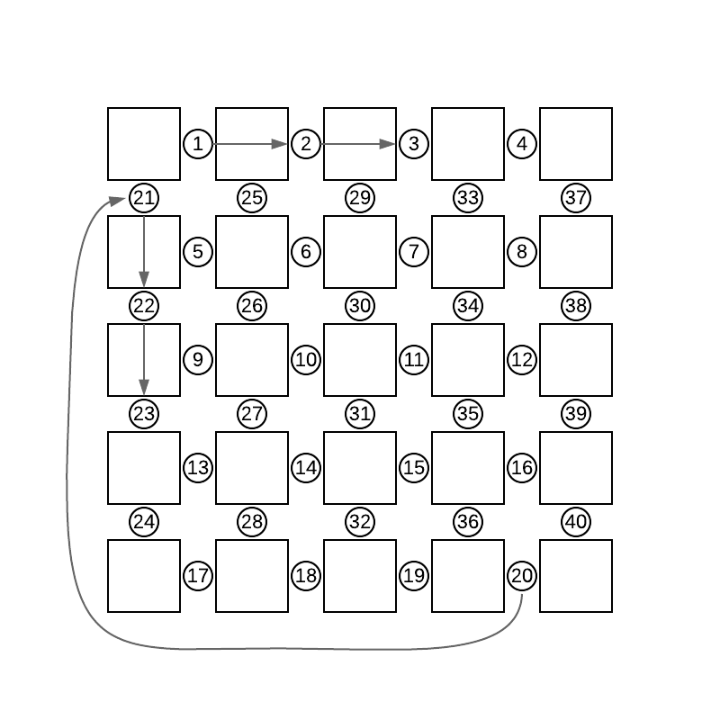

# Very Scary Problem

The very scary problem is a 5x5 grid of cells. Some of the cells are filled in with numbers and some of the cells are connected with inequalities. The solution to the very scary problem is found by filling in all of the empty cells such that all of following contraints remain true:

##### Constraints:
1. Each row must contain all of the digits 1 through 5
2. Each column must contain all of the digits 1 through 5
3. All inequalties are true.

Below is an example of an unsolved puzzle, followed by it's solution.



## Input

The input will constist of two lines:

The first line is a string with length of 25 characters with the digits '1','2','3','4','5' or '0'. A '0' is given for cells that start empty. They are ordered beginning with top left cell and then going left to right and then top down just as you would read english.

The second line is a string with a length of 40 characters including '<', '>', and '|'. Their order corresponds to the circles in the figure below. For example, if the first sign is '<', the the top left square must be less than the square to the right. For symbols that are between rows, a '>' means that the square above is greater than the square below.  For example, if the 21st character is '>', then the top left square must be greater than the one below it. The '|' symbol means that there is no constraint.




> All inputs will have exactly one valid solution

## Output

The output should be given as a string of 25 characters. Order them beginning with top left cell and then going left to right and then top down just as you would read in English.

> The example input and output are for the puzzle in the figures above.

## Examples
#### Input 0
```
0000404010000000000000000
|<|>|||||<|||||||||||<|<|||||||||||<>|<|
```
#### Output 0
```
3125424513523411342545132
```